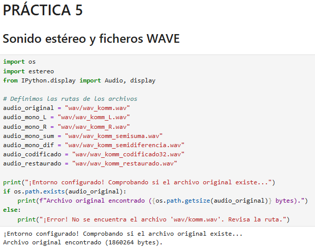
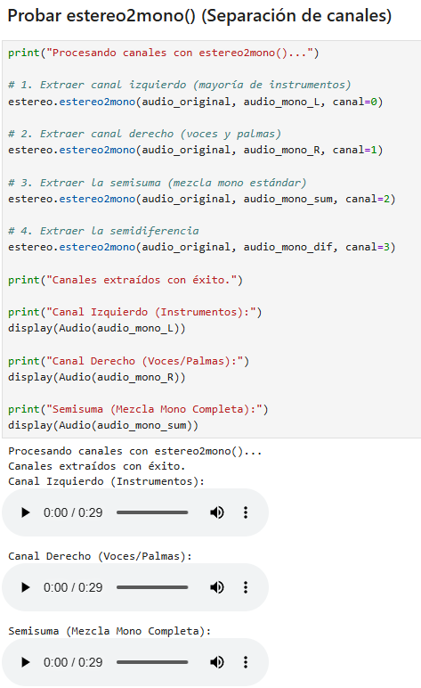
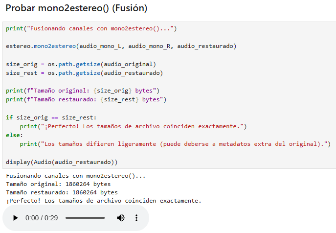
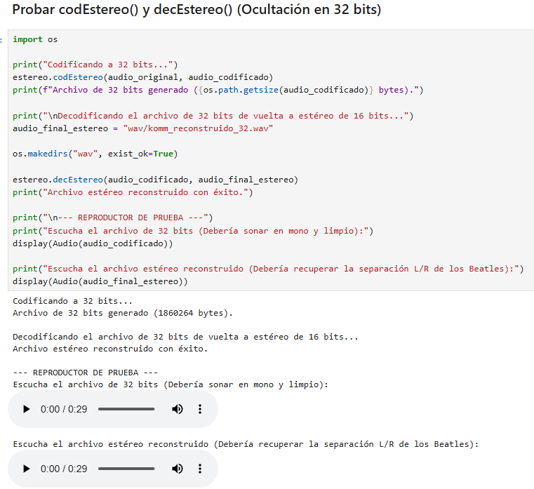

# Sonido estéreo y ficheros WAVE

## Eloi Belmonte Alcalá

> [!Important]
> Introduzca a continuación su nombre y apellidos:
>
> Eloi Belmonte Alcalá

## Aviso Importante

> [!Caution]
> 
> El objetivo de esta tarea es manejar la lectura y escritura de ficheros binarios. Para ello, sólo se
> permite el uso de las funciones de la biblioteca `struct`. Aunque existen distintas bibliotecas que
> permiten manejar los ficheros WAVE de una manera más eficiente y sencilla, su uso está prohibido.
>
> ¿Quiere saber más?, consulte con el profesorado.

## Fecha de entrega: 24 de mayo a medianoche

## El formato WAVE

El formato WAVE es uno de los más extendidos para el almacenamiento y transmisión
de señales de audio. En el fondo, se trata de un tipo particular de fichero
[RIFF](https://en.wikipedia.org/wiki/Resource_Interchange_File_Format) (*Resource
Interchange File Format*), utilizado no sólo para señales de audio sino también para señales de
otros tipos, como las imágenes estáticas o en movimiento, o secuencias MIDI (aunque, en el caso
del MIDI, con pequeñas diferencias que los hacen incompatibles).

La base de los ficheros RIFF es el uso de *cachos* (*chunks*, en inglés). Cada cacho,
o subcacho, está encabezado por una cadena de cuatro caracteres ASCII, que indica el tipo del cacho,
seguido por un entero sin signo de cuatro bytes, que indica el tamaño en bytes de lo que queda de
cacho sin contar la cadena inicial y el propio tamaño. A continuación, y en función del tipo de
cacho, se colocan los datos que lo forman.

Todo fichero RIFF incluye un primer cacho que lo identifica como tal y que empieza por la cadena
`'RIFF'`. A continuación, después del tamaño del cacho y en otra cadena de cuatro caracteres,
se indica el tipo concreto de información que contiene el fichero. En el caso concreto de los
ficheros de audio WAVE, esta cadena es igual a `'WAVE'`, y el cacho debe contener dos
*subcachos*: el primero, de nombre `'fmt '`, proporciona la información de cómo está
codificada la señal. Por ejemplo, si es PCM lineal, ADPCM, etc., o si es monofónica o estéreo. El
segundo subcacho, de nombre `'data'`, incluye las muestras de la señal.

Dispone de una descripción detallada del formato WAVE en la página
[WAVE PCM soundfile format](http://soundfile.sapp.org/doc/WaveFormat/) de Soundfile.

## Audio estéreo

La mayor parte de los animales, incluidos los del género *homo sapiens sapiens* sanos y completos,
están dotados de dos órganos que actúan como transductores acústico-sensoriales (es decir, tienen dos
*oídos*). Esta duplicidad orgánica permite al bicho, entre otras cosas, determinar la dirección de
origen del sonido. En el caso de la señal de música, además, la duplicidad proporciona una sensación
de *amplitud espacial*, de realismo y de confort acústico.

En un principio, los equipos de reproducción de audio no tenían en cuenta estos efectos y sólo permitían
almacenar y reproducir una única señal para los dos oídos. Es el llamado *sonido monofónico* o
*monoaural*. Una alternativa al sonido monofónico es el *estereofónico* o, simplemente, *estéreo*. En
él, se usan dos señales independientes, destinadas a ser reproducidas a ambos lados del oyente: los
llamados *canal izquierdo* (**L**) y *derecho* (**R**).

Aunque los primeros experimentos con sonido estereofónico datan de finales del siglo XIX, los primeros
equipos y grabaciones de este tipo no se popularizaron hasta los años 1950 y 1960. En aquel tiempo, la
gestión de los dos canales era muy rudimentaria. Por ejemplo, los instrumentos se repartían entre los
dos canales, con unos sonando exclusivamente a la izquierda y el resto a la derecha. Es el caso de las
primeras grabaciones en estéreo de los Beatles: las versiones en alemán de los singles *She loves you*
y *I want to hold your hand*. Así, en esta última (de la que dispone de un fichero en Atenea con sus
primeros treinta segundos, [Komm, gib mir deine Hand](wav/komm.wav)), la mayor parte de los instrumentos
suenan por el canal derecho, mientras que las voces y las características palmas lo hacen por el izquierdo.

Un problema habitual en los primeros años del sonido estereofónico, y aún vigente hoy en día, es que no
todos los equipos son capaces de reproducir los dos canales por separado. La solución comúnmente
adoptada consiste en no almacenar cada canal por separado, sino en la forma semisuma, $(L+R)/2$, y
semidiferencia, $(L-R)/2$, y de tal modo que los equipos monofónicos sólo accedan a la primera de ellas.
De este modo, estos equipos pueden reproducir una señal completa, formada por la suma de los dos
canales, y los estereofónicos pueden reconstruir los dos canales estéreo.

Por ejemplo, en la radio FM estéreo, la señal, de ancho de banda 15 kHz, se transmite del modo siguiente:

- En banda base, $0\le f\le 15$ kHz, se transmite la suma de los dos canales, $L+R$. Esta es la señal
  que son capaces de reproducir los equipos monofónicos.

- La señal diferencia, $L-R$, se transmite modulada en amplitud con una frecuencia de portadora
  $f_m = 38$ kHz.

  - Por tanto, ocupa la banda $23 \mathrm{kHz}\le f\le 53 \mathrm{kHz}$, que sólo es accedida por los
    equipos estéreo, y, en el caso de colarse en un reproductor monofónico, ocupa la banda no audible.

- También se emite una sinusoide de $19 \mathrm{kHz}$, denominada *señal piloto*, que se usa para
  demodular síncronamente la señal diferencia.

- Finalmente, la señal de audio estéreo puede acompañarse de otras señales de señalización y servicio en
  frecuencias entre $55.35 \mathrm{kHz}$ y $94 \mathrm{kHz}$.

En los discos fonográficos, la semisuma de las señales está grabada del mismo modo que se haría en una
grabación monofónica, es decir, en la profundidad del surco; mientras que la semidiferencia se graba en el
desplazamiento a izquierda y derecha de la aguja. El resultado es que un reproductor mono, que sólo atiende
a la profundidad del surco, reproduce casi correctamente la señal monofónica, mientras que un reproductor
estéreo es capaz de separar los dos canales. Es posible que algo de la información de la semisuma se cuele
en el reproductor mono, pero, como su amplitud es muy pequeña, se manifestará como un ruido muy débil,
apenas perceptible.

En general, todos estos sistemas se basan en garantizar que el reproductor mono recibe correctamente la
semisuma de canales y que, si algo de la semidiferencia se cuela en la reproducción, sea en forma de un
ruido inaudible.

## Tareas a realizar

Escriba el fichero `estereo.py` que incluirá las funciones que permitirán el manejo de los canales de una
señal estéreo y su codificación/decodificación para compatibilizar ésta con sistemas monofónicos.


### Manejo de los canales de una señal estéreo

En un fichero WAVE estéreo con señales de 16 bits, cada muestra de cada canal se codifica con un entero de
dos bytes. La señal se almacena en el *cacho* `'data'` alternando, para cada muestra de $x[n]$, el valor
del canal izquierdo y el derecho:


#### Función `estereo2mono(ficEste, ficMono, canal=2)`

La función lee el fichero `ficEste`, que debe contener una señal estéreo, y escribe el fichero `ficMono`,
con una señal monofónica. El tipo concreto de señal que se almacenará en `ficMono` depende del argumento
`canal`:

- `canal=0`: Se almacena el canal izquierdo $L$.
- `canal=1`: Se almacena el canal derecho $R$.
- `canal=2`: Se almacena la semisuma $(L+R)/2$. Ha de ser la opción por defecto.
- `canal=3`: Se almacena la semidiferencia $(L-R)/2$.

#### Función `mono2estereo(ficIzq, ficDer, ficEste)`

Lee los ficheros `ficIzq` y `ficDer`, que contienen las señales monofónicas correspondientes a los canales
izquierdo y derecho, respectivamente, y construye con ellas una señal estéreo que almacena en el fichero
`ficEste`.

### Codificación estéreo usando los bits menos significativos

En la línea de los sistemas usados para codificar la información estéreo en señales de radio FM o en los
surcos de los discos fonográficos, podemos usar enteros de 32 bits para almacenar los dos canales de 16 bits:

- En los 16 bits más significativos se almacena la semisuma de los dos canales.

- En los 16 bits menos significativos se almacena la semidiferencia.

Los sistemas monofónicos sólo son capaces de manejar la señal de 32 bits. Esta señal es prácticamente
idéntica a la señal semisuma, ya que la semisuma ocupa los 16 bits más significativos. La señal
semidiferencia aparece como un ruido añadido a la señal, pero, como su amplitud es $2^{16}$ veces más
pequeña, será prácticamente inaudible (la relación señal a ruido es del orden de 90 dB).

Los sistemas estéreo son capaces de aislar las dos partes de la señal y, con ellas, reconstruir los dos
canales izquierdo y derecho.


#### Función `codEstereo(ficEste, ficCod)`

Lee el fichero `ficEste`, que contiene una señal estéreo codificada con PCM lineal de 16 bits, y
construye con ellas una señal codificada con 32 bits que permita su reproducción tanto por sistemas
monofónicos como por sistemas estéreo preparados para ello.

#### Función `decEstereo(ficCod, ficEste)`

Lee el fichero `ficCod` con una señal monofónica de 32 bits en la que los 16 bits más significativos
contienen la semisuma de los dos canales de una señal estéreo y los 16 bits menos significativos la
semidiferencia, y escribe el fichero `ficEste` con los dos canales por separado en el formato de los
ficheros WAVE estéreo.

### Entrega

#### Fichero `estereo.py`

- El fichero debe incluir una cadena de documentación que incluirá el nombre del alumno y una descripción
  del contenido del fichero.

- Es muy recomendable escribir, además, sendas funciones que *empaqueten* y *desempaqueten* las cabeceras
  de los ficheros WAVE a partir de los datos contenidos en ellas.

- Aparte de `struct`, no se puede importar o usar ningún módulo externo.

- Se deben evitar los bucles. Se valorará el uso, cuando sea necesario, de *comprensiones*.

- Los ficheros se deben abrir y cerrar usando gestores de contexto.

- Las funciones deberán comprobar que los ficheros de entrada tienen el formato correcto y, en caso
  contrario, elevar la excepción correspondiente.

- Los ficheros resultantes deben ser reproducibles correctamente usando cualquier reproductor estándar;
  por ejemplo, el Windows Media Player o similar. Es probable, muy probable, que tenga que modificar los
  datos de las cabeceras de los ficheros para conseguirlo.

- Se valorará lo pythónico de la solución; en concreto, su claridad y sencillez, y el uso de los estándares
  marcados por PEP-ocho.


  

```python
"""
Módulo para la manipulación de archivos de sonido WAVE estéreo y mono.

Nombre del alumno: Eloi Belmonte Alcalá
Descripción: Este módulo permite separar canales estéreo a mono, fusionar monos
             en estéreo y codificar/decodificar señales estéreo dentro de archivos
             monofónicos de 32 bits usando manipulación de bits.
"""

import struct


def _leer_cabecera(f):
    """
    Función interna para desempaquetar y validar la cabecera WAVE de 44 bytes.
    Retorna un diccionario con los metadatos y el tamaño del subchunk de datos.
    """
    cabecera = f.read(44)
    if len(cabecera) < 44:
        raise ValueError("El archivo es demasiado corto para ser un WAVE válido.")

    # Desempaquetamos según el formato estándar RIFF/WAVE
    # < (Little-endian), 4s (char[4]), I (uint32), 4s, 4s, I, H (uint16), H, I, I, H, H, 4s, I
    (
        riff_id, riff_size, wave_id,
        fmt_id, fmt_size, audio_fmt, num_channels, sample_rate,
        byte_rate, block_align, bits_per_sample,
        data_id, data_size
    ) = struct.unpack("<4sI4s4sIHHIIHH4sI", cabecera)

    if riff_id != b'RIFF' or wave_id != b'WAVE' or fmt_id != b'fmt ' or data_id != b'data':
        raise ValueError("Formato de archivo WAVE no válido o corrupto.")

    return {
        "riff_size": riff_size,
        "audio_fmt": audio_fmt,
        "num_channels": num_channels,
        "sample_rate": sample_rate,
        "byte_rate": byte_rate,
        "block_align": block_align,
        "bits_per_sample": bits_per_sample,
        "data_size": data_size
    }


def _crear_cabecera(num_channels, sample_rate, bits_per_sample, num_samples):
    """
    Función interna para empaquetar una cabecera WAVE válida de 44 bytes.
    """
    block_align = num_channels * (bits_per_sample // 8)
    byte_rate = sample_rate * block_align
    data_size = num_samples * block_align
    riff_size = 36 + data_size

    return struct.pack(
        "<4sI4s4sIHHIIHH4sI",
        b'RIFF', riff_size, b'WAVE',
        b'fmt ', 16, 1, num_channels, sample_rate,
        byte_rate, block_align, bits_per_sample,
        b'data', data_size
    )


```
  

#### Comprobación del funcionamiento

Es responsabilidad del alumno comprobar que las distintas funciones realizan su cometido de manera correcta.
Para ello, se recomienda usar la canción [Komm, gib mir deine Hand](wav/komm.wav), suminstrada al efecto.
De todos modos, recuerde que, aunque sea en alemán, se trata de los Beatles, así que procure no destrozar
innecesariamente la canción.



<br>



<br>



<br>



<br> 

Mientras que los ficheros de audio se encuentran en la carpeta wav de esta misma práctica. 

Tenemos:
  Segunda imagen (estereo2mono()):
  
    - Canal Izquierdo (Instrumentos) en el fichero (wav/wav_komm_L.wav)
    - Canal Derecho (Voces/Palmas) en el fichero (wav/wav_komm_R.wav)
    - Semidiferencia en el fichero (wav/wav_komm_semidiferencia.wav)
    - Semisuma (Mezcla mono completa) en el fichero (wav/wav_komm_semisuma.wav)

  Tercera imagen (mono2estereo):
  
    - Fusión (wav/wav_komm_restaurado.wav)

  Cuarta imagen (codEstereo() y decEstereo())_
  
    - Codificación 32 bits (wav/wav_komm_codificado32.wav)
    - Decodificación 32 bits (wav/komm_reconstruido_32.wav)

#### Código desarrollado

Inserte a continuación el código de los métodos desarrollados en esta tarea, usando los comandos necesarios
para que se realice el realce sintáctico en Python del mismo (no vale insertar una imagen o una captura de
pantalla, debe hacerse en formato *markdown*).

##### Código de `estereo2mono()`

```python
def estereo2mono(ficEste, ficMono, canal=2):
    """
    Lee un fichero estéreo de 16 bits y extrae el canal solicitado a un fichero mono.
    Canal: 0=L, 1=R, 2=Semisuma (L+R)/2, 3=Semidiferencia (L-R)/2.
    """
    with open(ficEste, "rb") as f_in:
        meta = _leer_cabecera(f_in)
        
        if meta["num_channels"] != 2 or meta["bits_per_sample"] != 16:
            raise ValueError("El archivo de entrada debe ser estéreo de 16 bits.")

        # Leer todos los datos de audio
        data_bytes = f_in.read(meta["data_size"])
        num_muestras = meta["data_size"] // 4  # 2 canales * 2 bytes = 4 bytes por muestra estéreo
        
        # Desempaquetar muestras alternadas: L, R, L, R...
        muestras = struct.unpack(f"<{num_muestras * 2}h", data_bytes)
        
        # Separar canales usando slicing de listas
        L = muestras[0::2]
        R = muestras[1::2]

        # Procesar según el canal solicitado mediante comprensiones de listas
        if canal == 0:
            resultado = L
        elif canal == 1:
            resultado = R
        elif canal == 2:
            resultado = [(l + r) // 2 for l, r in zip(L, R)]
        elif canal == 3:
            resultado = [(l - r) // 2 for l, r in zip(L, R)]
        else:
            raise ValueError("Canal no válido. Debe ser 0, 1, 2 o 3.")

    # Escribir el nuevo archivo monofónico de 16 bits
    with open(ficMono, "wb") as f_out:
        cabecera = _crear_cabecera(1, meta["sample_rate"], 16, len(resultado))
        f_out.write(cabecera)
        f_out.write(struct.pack(f"<{len(resultado)}h", *resultado))
```

##### Código de `mono2estereo()`

```python
def mono2estereo(ficIzq, ficDer, ficEste):
    """
    Lee dos ficheros mono de 16 bits (izquierdo y derecho) y los une en uno estéreo.
    """
    with open(ficIzq, "rb") as f_izq, open(ficDer, "rb") as f_der:
        meta_izq = _leer_cabecera(f_izq)
        meta_der = _leer_cabecera(f_der)

        if meta_izq["num_channels"] != 1 or meta_der["num_channels"] != 1:
            raise ValueError("Ambos archivos de entrada deben ser monofónicos.")
        if meta_izq["sample_rate"] != meta_der["sample_rate"]:
            raise ValueError("Los archivos deben tener la misma frecuencia de muestreo.")

        # Leer y desempaquetar las muestras de cada canal
        data_izq = f_izq.read(meta_izq["data_size"])
        data_der = f_der.read(meta_der["data_size"])
        
        num_muestras = min(meta_izq["data_size"], meta_der["data_size"]) // 2
        
        L = struct.unpack(f"<{num_muestras}h", data_izq[:num_muestras*2])
        R = struct.unpack(f"<{num_muestras}h", data_der[:num_muestras*2])

        # Intercalar canales: [L0, R0, L1, R1, ...] usando comprensión
        muestras_estereo = [muestra for par in zip(L, R) for muestra in par]

    # Escribir el archivo estéreo de 16 bits
    with open(ficEste, "wb") as f_out:
        cabecera = _crear_cabecera(2, meta_izq["sample_rate"], 16, num_muestras)
        f_out.write(cabecera)
        f_out.write(struct.pack(f"<{len(muestras_estereo)}h", *muestras_estereo))
```

##### Código de `codEstereo()`

```python
def codEstereo(ficEste, ficCod):
    """
    Codifica un fichero estéreo de 16 bits en un fichero mono de 32 bits.
    Bits más significativos (MSB): Semisuma. Bits menos significativos (LSB): Semidiferencia.
    """
    with open(ficEste, "rb") as f_in:
        meta = _leer_cabecera(f_in)

        if meta["num_channels"] != 2 or meta["bits_per_sample"] != 16:
            raise ValueError("El archivo de entrada debe ser estéreo de 16 bits.")

        data_bytes = f_in.read(meta["data_size"])
        num_muestras = meta["data_size"] // 4
        
        muestras = struct.unpack(f"<{num_muestras * 2}h", data_bytes)
        L = muestras[0::2]
        R = muestras[1::2]

        # Calcular semisuma y semidiferencia
        semisuma = [(l + r) // 2 for l, r in zip(L, R)]
        semidiferencia = [(l - r) // 2 for l, r in zip(L, R)]

        # Empaquetar en enteros de 32 bits (con signo) mediante operaciones de bits
        # Se aplica '& 0xFFFF' a la semidiferencia para asegurar que al unirse actúe como un patrón de 16 bits sin signo.
        muestras_32 = [((ss << 16) | (sd & 0xFFFF)) for ss, sd in zip(semisuma, semidiferencia)]

    # Guardar como un archivo MONO de 32 bits
    with open(ficCod, "wb") as f_out:
        cabecera = _crear_cabecera(1, meta["sample_rate"], 32, len(muestras_32))
        f_out.write(cabecera)
        f_out.write(struct.pack(f"<{len(muestras_32)}i", *muestras_32))
```

##### Código de `decEstereo()`

```python
def decEstereo(ficCod, ficEste):
    """
    Decodifica un fichero mono de 32 bits y reconstruye el fichero estéreo de 16 bits original.
    """
    with open(ficCod, "rb") as f_in:
        meta = _leer_cabecera(f_in)

        if meta["num_channels"] != 1 or meta["bits_per_sample"] != 32:
            raise ValueError("El archivo codificado debe ser monofónico de 32 bits.")

        data_bytes = f_in.read(meta["data_size"])
        num_muestras = meta["data_size"] // 4  # 4 bytes por muestra de 32 bits
        
        muestras_32 = struct.unpack(f"<{num_muestras}i", data_bytes)

        # Extraer semisuma (desplazando a la derecha con signo)
        semisuma = [m >> 16 for m in muestras_32]
        
        # Extraer semidiferencia (aislando los 16 bits inferiores y recuperando el signo)
        # Convertimos el entero sin signo de 16 bits resultante del bitwise AND en un entero con signo
        semidiferencia_raw = [m & 0xFFFF for m in muestras_32]
        semidiferencia = [sd if sd < 0x8000 else sd - 0x10000 for sd in semidiferencia_raw]

        # Reconstruir L y R algebraicamente:
        # L = Semisuma + Semidiferencia
        # R = Semisuma - Semidiferencia
        L = [ss + sd for ss, sd in zip(semisuma, semidiferencia)]
        R = [ss - sd for ss, sd in zip(semisuma, semidiferencia)]

        # Intercalar canales para el formato estéreo
        muestras_estereo = [muestra for par in zip(L, R) for muestra in par]

    # Guardar el archivo estéreo de 16 bits restaurado
    with open(ficEste, "wb") as f_out:
        cabecera = _crear_cabecera(2, meta["sample_rate"], 16, num_muestras)
        f_out.write(cabecera)
        f_out.write(struct.pack(f"<{len(muestras_estereo)}h", *muestras_estereo))
```

#### Subida del resultado al repositorio GitHub y *pull-request*

La entrega se formalizará mediante *pull request* al repositorio de la tarea.

El fichero `README.md` deberá respetar las reglas de los ficheros Markdown y visualizarse correctamente en
el repositorio, incluyendo el realce sintáctico del código fuente insertado.
